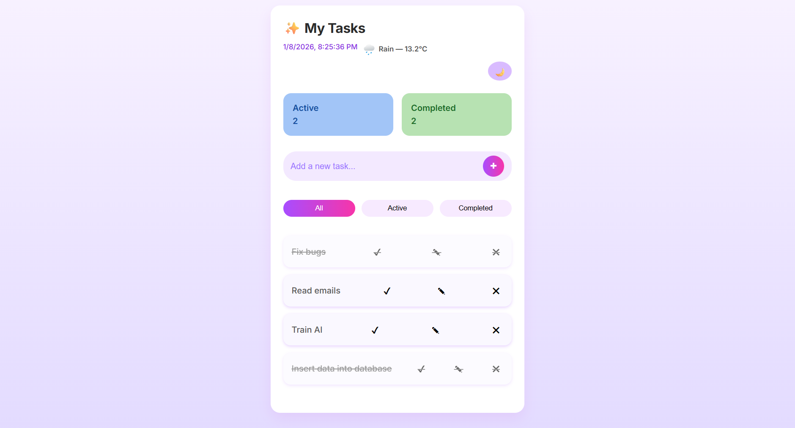
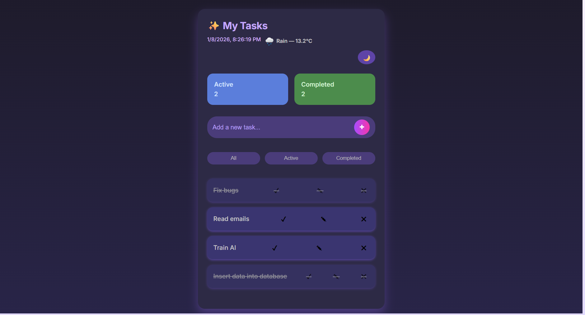

# 📝 Task Manager App

A clean and modern task manager built with **vanilla JavaScript**, HTML, and CSS.  
Manage your tasks efficiently with a sleek, responsive interface, dark mode, live date/time, and real-time weather info.  

---


## 📸 Screenshots

| ☀️ Light Mode | 🌙 Dark Mode |
|--------------|-------------|
|  |  |


---

## ✨ Features

- Add, delete, and edit tasks (double-click a task to edit)
- Mark tasks as completed
- Filter tasks (All / Active / Completed)
- Persistent storage using `localStorage`
- Dark mode toggle
- Live date & time
- Real-time weather information via Open-Meteo API
- Responsive & modern UI for desktop and mobile

---

## 🛠️ Technologies Used


---

## 🖥️ Prerequisites

- Modern web browser (Chrome, Firefox, Edge, Safari)  
- No server required; just open `index.html` in your browser

---

## 🚀 Live Demo

You can enable GitHub Pages for this repository to view it live:  
`https://sarang-1996.github.io/Task-Manager/`

---

## 📦 How to Run Locally

1. Clone the repository:  
   ```bash
   git clone https://github.com/sarang-1996/Task-Manager.git


---

## 📄 License

This project is licensed under the [MIT License](LICENSE) - see the LICENSE file for details.

---

made by Sara Carvalho for a javascript class @cesae digital
💻 https://github.com/sarang-1996
